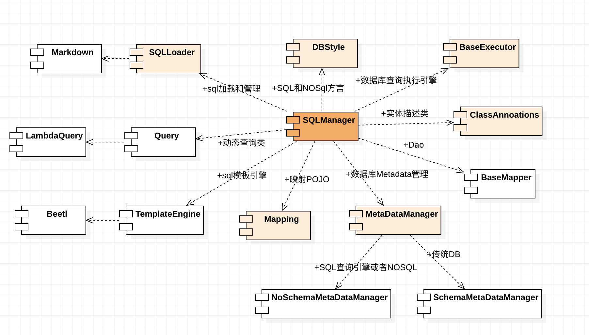
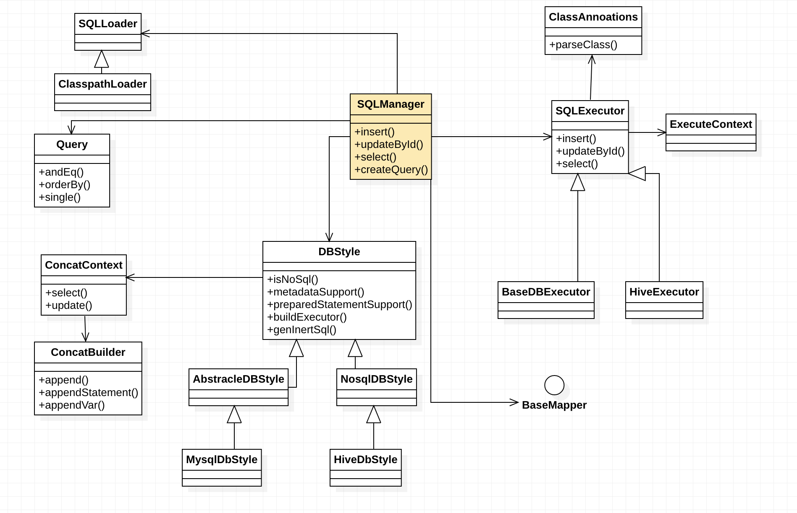

# BeetlSQL3.0 新增功能

注意:本文档只介绍新增或者要重构的功能，对于BeetlSQL 已有功能不再介绍。BeetlSQL2.0的功能足够多额

##组件图

 

## 核心类





## 1 （完成）@Table和 @Column

新增@Column用于指定注解别名，NameConversion子类需要优先考虑这个注解来实现命名转化。参考

~~~java
public class User{
  
  @Column("id_") Long id;
}
~~~

> 不同于2.0使用JPA注解，因为JPA注解很不方便,主要是还需要显示的导入JPA包，另外，JPA Column的注解含义过多，beetlsql并未完全支持这些含义

## 2 （完成）@RowMapper 指定一个类完成查询与映射

RowMapper注解表明在映射的单行的时候，需要参考注解指定的类

~~~java
@RowMapper(xxx.class)
public class UserRoleData{
  
}
~~~

> 放弃在SQLManager中指定RowMapper功能（但不排除兼容）这是因为通常一个entity只有一种映射方式
>
> 


## 3 （完成）@ResultMapper

为指定对象提供一个@ResultMapper,用于通过自定义映射配置映射，逐渐支持复杂映射

```xml
<xml>
<mapping id="userMapping">
<col name="id_" attr="id"></col>  
</mapping>
</xml>
```


~~~java
@ResultMapper(MyBatisMapper.class)
public class User{
  private List<Role> rols 。
}
~~~

这里MyBatisMapper 实现了EntityMapper接口

```java
public List<Object> map(ResultSet rs,Target class,Context);
```


## （完成）@EnumMapping和@EumValue

此功能为改善2.0功能，作用在类上，建议作用在属性上或者getter方法上

~~~java
public enum Color {
    RED("RED",1),BLUE ("BLUE",2);
    private String name;
    @EumnValue
    private int value;
~~~

## 5  (完成) @TemplateSql

同Mapper的@Sql一样，支持模板变量，比如

```java
public interface UserDao extends BaseMapper{
  @Sql("select * from beetlSQLSysUser where id=?")
  public User query(Integer id);
  
  @TemplateSql("select * from beetlSQLSysUser where id=#id#)
  public User queryById(Integer id);         
}

```


## 6  @SpringData

提供一个SrpingData 函数命名风格的的接口（低优先级）

```java
public interface UserDao extends BaseMapper{
  @Sql("select * from beetlSQLSysUser where id=?")
  public User query(Integer id);
  
  @SpringData
  public User queryById(Integer id);         
}
```

> SrpingData 通过方法名推测sql，比如getByLikeName（String name） 类似 select * from beetlSQLSysUser where name like #name#


可以使用sql-concat包来实现这个功能

## 7 @Ds

Spring下使用，指定一个注入的Mapper使用哪个数据源
```java
@Ds("xxxx")
public interface UserDao extends BaseMapper{}
```

或者注入到Spring的时候

```java
public class UserService{
  
  @Ds("xxxx")
  @Autowried
  UserDao dao；
}
```

允许通过一个Helper类获取到这些dao

```java
UserDao dao = DynamicHelper.ds("xxxx").getDao(UserDao.clss);
```


## 8 @View

实体如果有View注解，那么在任何查询的时候，都会考虑到这个注解指定的属性是否应该作为返回结果与部分，View应以灵活组合

~~~java
public class User{
	@View(BigData.class)
	private byte[] blob;
  @View(KeyData.class)
  private int id;
  
}
~~~


```java

//只包含了blob
Usere beetlSQLSysUser = sqlManager.runner().veiwType(BigData.class).single(User.class,1)

//只包含了id
Usere beetlSQLSysUser = sqlManager.runner().veiwType(KeyData.class).single(User.class,1)


```


Runner 返回一个可配置的查询类，用于实现各种复杂的查询要求，比如

```java
 sqlManager.runner().veiwType(KeyData.class).rowMapper(XXX.class).select();
```


## 9 SQL Concat

可以通过sql构造器生成sql代码或者sql模板代码，同时，Query类底层也采用sql构造器来生成sql

```
Select select = sqlBuilder.select();

select.from(User.class).andEq("name","lijz").sub("or",where->{
    where.andEq("age",12).andEq("age",13);
});

String sql = select.toSql();
List<Object> vars = sql.toVars();


```

sql-concat是beetlsql的基础包之一，用于构造Query对象或者内置的sql语句生成

## 10 JPA支持 重要

orm不在作为扩展，而单独作为一个重要模块，遵守JPA规则。 实现简单的ORM，可以参看EBean看看

通过orm注解来表明查询是一个orm查询

```java
@OrmContainer
public class User{
  @One2One
	private Org org;
}
```

由于实现一个JPA，需要工作量，可以参考把EBean整合进来


## 11 NOSQL支持 重要

对于支持JDBC的NOSQL数据库来说，如果支持dbmetadata，那么，也应该让beetlsql支持，比如内置的操作，md管理sql脚本等等


考虑到NSOQL的jdbc驱动不一定支持所有的特性，因此，允许通过类注解来表达NOSQL的metadata，比如

```
TableDesc hiveTable = hiveDbStyle.createTableDesc(User.class);
List<Col> cols = hiveTable.getCols();
```

> hiveDbStyle需要考虑是否完全根据类定义，还是综合部分jdbc metadata返回的数据来得出TableDesc


另外一个是NOSQL通常不支持PreparedStatement，而只有Statement，所以，应该根据dbStyle来确定是否使用PreparedStatement


## 12 完成 PageRequest和PageResult接口

分页功能

```java
public class PageQuery   implements PageRequest,PageResult{
  
}
```

提供用户自定义PageRequest,Page的功能

PageRequest 包含了翻页的相关参数，Page表示查询结果，比如查询总数，当前页面，总页面等

> 之所以不鼓励使用PageQuery，是因为用户想自己定制分页对象，


## 13 批处理增强

指定一次处理的总数，以避免数据库限制
```java
updateBatch(List list,int max);
```
另外一个增强，是批处理insertBatchTemplate

> 2.0版本并没有限制一次批处理的大小，完全依赖jdbc或者数据库的大小，不利于跨数据库。新的API可以指定一个大小，或者全局配置一个，比如1000个为一个批次


## 14 （完成）SQLManagerBuilder

构造SQLManager比较麻烦，采用和加强SQLManagerBuilder，提供各种方便配置
```java
SQLManaerBuilder.style(MySQL.class).nc(DefaultNameConversion.class)
```
考虑把数据库归类一下，用枚举，很多地方用的到

> 2.0 已经有了SQLManagerBuilder，但未正式推出，在3.0后，文档和代码将以此为主

##15 (完成) BaseMapperBuilder

创建BaseMapper的方便方法

```java
MapperBuilder.add(AmiAdd.class).add(AmiUpdateById.class).warp(MyBasMapper.class)
```

需要脱离SQLManager，因为多数据源情况


## 16（设计完成）代码生成

专有代码生成包，提供数据库信息，表信息，可能得类名和属性名信息，用户自有生成entity，dao，service，controlller，甚至js代码
也提供默认的author，corp等信息，版权信息（可以作为模板使用）
是否需要schema，是否使用double等。

也需要考虑并行或者串行（依赖）处理，比如一次生成多个文件(前后端，配置文件)


可以生成一些常量类表示数据库表名和列名

## 17 单元测试

单元测试采用H2内存数据库，提供一些数据库基本验证方法供比较，比如

```java
asser(result,Expected.has(User.class,1))
assert(result,Expected.count(User.class));
```


## 18 多数据源切换支持

已经支持多数据源，但不支持切换

可以通过注解或者显示的调用支持多数据源，比如

```java
@Ds(xxx)
private UserDao dao;

或者

UserDao dao = DataSourceUtil.switch("xxxx").getDao(UserDao.class);  
```


## 19  Idea 插件支持

https://gitee.com/linbin/beetl-pluging?_from=gitee_search

已经有支持，需要完善，比如，增加提示有哪些sqlId可以用 


## 20  多租户支持？
如何搞？调用多租户需求以及DAO如何配合才能方便开发。根据租户标记做哪些事情，修改sql，修改数据源？或者依赖DynamicDataSource这种更底层机制来处理，而beetlsql不用管？

目前提供了MultiTenantSpringConnectionSourcece


## 21 存储过程支持

支持存储过程入参和出参的封装


## 22 （完成）重要SQLExecutor 和 ExecucteContext


```
ExecucteContext context = ....
SQLExecutor executor = dbStyle.create(context);
return executor.insert(obj);
```

SQLExecutor是实际执行beetlsql的操作，包含了增删改查所有逻辑，一个典型的子类是beetlsql2.0的核心类SQLScript

ExecucteContext 一个新的类，当调用sqlManager的api的时候，用来记录入参，配置，以及执行过程，这个类非常重要，决定了beetlsql实际的特性，记录如下

* sqlId
* 是否是内置sql
* sql类型，select，update,insert,delete,unkonw
* 入参
* 出惨类型
* sql模板渲染结果的sql
* sql模板渲染结果的jdbc 参数
* viewType
* RowMapper或者ResultMapper
* 动态的一些上下文值，用来传递给下一个执行环节（如模板渲染过程中可以设置一些配置）

~~~markdown
xxxx
===

select * from xxxx where 1=1
@if(xxxx=1){
@ context.setRowmMapper("simple");
@}
~~~

setRowmMapper可以动态决定如何映射


## 23 代替默认的内置sql

beetlsql可以为CRUD提供内置的生成的sql，可以代码生成这些内置sql

可以在md文件中用sql片段代替内置sql，覆盖其实现（TODO，一般通过注解来改变内置sql）

以内置的updateById来说

```markdown
_insert
===

insert into
```


## 24 事务超时时间支持

在spring下，需要验证，有人说不支持，按理说跟Dao工具没关系，应该是Spring设置数据源数据库连接

## 25 完成 JDK8
采用JDK8写法，支持JDK的日期类型等

## 26 sql支持从其他地方加载，比如文件系统，或者数据库.


```
SQLLoader loader = new DbSQLLoader();
```


## 26 引入第三方包

* 包含appache common lang，log
* https://github.com/fangjinuo/sqlhelper


## 27 根据URL判断数据库风格

根据jdbc url来自动判断数据库风格，可以参考其他源码，不需要填写DBStyle


## 28 sonar 插件
参考
https://www.oschina.net/news/109465/sonarqube-mybatis-plugin-1-0-3-released


## 29 （完成）支持数据库自动生成建，比如自增，或者其他方式生成

取消KeyHolder，既然一般业务系统都关注主健，因此默认都取出组件 

## 30 性能分析输出

将SQL性能执行数据标准化，并可以输出到文件系统或者其他系统

```
<xml>
<sql sqlId="" total="100" average="40ms"> select * from beetlSQLSysUser </sql>
<sql sqlId="" total="100" average="40ms"> select * from beetlSQLSysUser </sql>
</xml>
```


## 31  Bean分析

分析entity与对应都table或者sql之间的差别，比如table中某列在entity不存在， 差异可以直接打印。也可以直接输出到其他系统

```
Java：User -> Table User_
1) Entity无主键
2) Entity的name属性在表中无对应关系
```

需要进一步考虑可以作为历史存储，比较，以方便运维系统

## 32 提供一个Map子类

有些小程序只需要Map，因此可以提供子类，让sql查询映射到这个类上，子类提供一些便捷的业务方法

```
RowMap map = sqlManager.unique("");
int age = map.getInt("age");
```


## 33 中英文支持

错误提示根据local来输出，默认支持中文，英文


## 34 SQL Manager  GROUP

可以将多个SQL Manager 放到一组，并有一个SQL Manager Proxy代替，这样，可以切换sqlmanager

 

## 口号收集

* 不是代替SQL，是Java更好的使用SQL
* Cross SQL DataBase
* SQL和NOSQL，一个API
* Type Safe Support
* 每个组件都可以替换和重写
* 更好的管理SQL
* 轻松重构


## 文档

1 增加文档，说明如何扩展，比如不用markdown,用xml，然后sql模板采用velocity，


