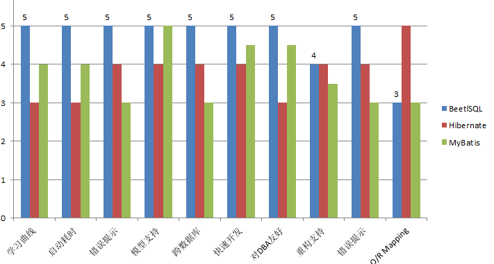
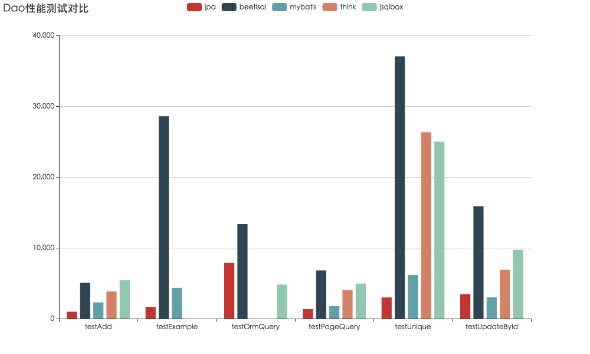

# BeetlSQL3

BeetlSQL 能极大的提高项目的开发效率，改善系统的数据库访问性能，避免数据库重构，换库带来的影响

* 作者: 闲大赋,Gavin.King,Sue,Zhoupan，woate,darren
* 开发时间:201507-202007
* 网站 http://ibeetl.com
* qq群 219324263
* 当前版本 3 (目前在研发过程中)
* 文档地址: http://ibeetl.com/ 

# BeetlSQLl 特点

BeetSql是一个全功能DAO工具， 同时具有Hibernate 优点 & Mybatis优点功能，适用于承认以SQL为中心，同时又需求工具能自动能生成大量常用的SQL的应用

* 派别:SQL为中心
  * 内置常见增删改查功能，节省项目50%工作量
  * 强化SQL管理，通过md文件管理sql，使用Beetl模板编写复杂sql
  * 简单SQL可以通过Query类链式API完成
* 全面支持跨数据库平台
* 支持NOSQL，如ClickhHouse，Elastic，Hive等
* 支持SQL查询引擎，如Apache Drill，Presto等
* 支持一对一，一对多等常见的映射。
* 可以使用约定习俗映射，复杂查询结果支持通过json配置映射到POJO
* 提供idea插件
* 其他
   * 具备代码生成功能，提供代码生成框架
   * 最大程度减少数据库重构对项目造成的影响
   * 最大程度减少数据库切换对项目造成的影响
   * 支持多数据源，数据源包含传统数据库，NOSQL，SQL查询引擎,且可以根据规则使用数据源
   * 内置主从支持
   * 提供丰富的扩展功能，80%的功能都可以自行扩展，打造自己个性化的数据库发访问框架，扩展适应新的数据库&NOSQL&查询引擎


> 如果你已经了解过BeetlSQL，或者曾用过流行DAO框架，可以直接跳到[BeetlSQL Sample](https://gitee.com/xiandafu/beetlsql/tree/3.0/sql-samples/sql-sample-quickstart)工程查看例子
>
> 如果你熟悉BeetlSQL 想查看如果BeetlSQL架构和如何定制BeetlSQL，可以查看 [定制BeetlSQL](doc/3.0-master.md)


# 组件图	


# 内置增删改查

* void insert(T entityClass);
* int updateById(T entityClass);
* int updateTemplateById(T entityClass);
* int deleteById(Object autoKey);
* T unique(Object autoKey);
* T single(Object autoKey);
* T lock(Object autoKey);
* List<T> all(); 
* List<T> template(T entityClass);
* <T> T templateOne(T entityClass);
* List<T> execute(String sql,Object... args);
* ....等等大量内置方法

# Query查询

~~~java

List<User> list = userMapper.createQuery().andEq("name","hi").orderBy("create_date").select();
~~~
如果是Java8,则可以
~~~java
List<User> list1  = userMapper.createLambdaQuery().andEq(User::getName, "hi").orderBy(User::getCreateDate).select();
~~~
Query接口分为俩类：

一部分是触发查询和更新操作，api分别是

* select 触发查询，返回指定的对象列表
* single 触发查询，返回一个对象，如果没有，返回null
* count 对查询结果集求总数
* delete 删除符合条件的结果集
* update 更新选中的结果集

另外一部分是各种条件：


| 方法                       | 等价sql                  |
| ------------------------ | ---------------------- |
| andEq,andNotEq           | ==,!=                  |
| andGreat,andGreatEq      | >,>=                   |
| andLess,andLessEq        | <,<=                   |
| andLike,andNotLike       | LIKE,NOT LIKE          |
| andIsNull,andIsNotNull   | IS NULL,IS NOT NULL    |
| andIn ,andNotIn          | IN (...) , NOT IN(...) |
| andBetween,andNotBetween | BETWEEN ,NOT BETWEEN   |
| and                      | and ( .....)           |
| or系列方法                   | 同and方法                 |
| limit                    | 限制结果结范围，依赖于不同数据库翻页     |
| orderBY                  | ORDER BY               |
| groupBy                  | GROUP BY               |


# Mapper

系统通常只需要提供Mapper接口方法，就能调用数据库并返回期望结果,BeetlSQL为你做好一切具体事情

~~~java
    @Sql("select * from beetlSQLSysUser where id = ?")
    UserEntity queryUserById(Integer id);

    @Sql("update beetlSQLSysUser set name=? where id = ?")
    @Update
    int updateName(String name,Integer id);

    @Template("select * from beetlSQLSysUser where id = #{id}")
    UserEntity getUserById(Integer id);

    @SpringData
    List<UserEntity> queryByNameOrderById(String name);

    /**
     * 可以定义一个default接口
     * @return
     */
     default  List<DepartmentEntity> findAllDepartment(){
        Map paras = new HashMap();
        paras.put("exlcudeId",1);
        List<DepartmentEntity> list = getSQLManager().execute("select * from department where id != #{exlcudeId}",DepartmentEntity.class,paras);
        return list;
    }


    /**
     * 调用sql文件user.md#select
     * @param name
     * @return
     */
     List<UserEntity> select(String name);


    /**
     * SimpleJoinMappper 
     * @return
     */
    @Sql("select u.id `beetlSQLSysUser.id` ,u.name `beetlSQLSysUser.name` ,d.id `dept.id`,d.name `dept.name` " +
             " from beetlSQLSysUser u  left join department d on d.id=u.department_id")
     List<S2MappingSample.MyUserView> allUserView();

    /**
     * 翻页查询,调用user.md#pageQuery
     * @param deptId
     * @param pageRequest
     * @return
     */
     PageResult<UserEntity>  pageQuery(Integer deptId, PageRequest pageRequest);
~~~

> BaseMapper 是内置的接口，包含了常见的CRUD方法


对应的sql文件是user.md,内容如下

~~~markdown
select
===

```sql
select * from beetlSQLSysUser u where 1=1 
-- @ if(isNotEmpty(name)){
and name like #{'%'+name+'%'}
-- @ }
order by u.id desc
```

pageQuery
===

```sql
select #{page('*')} from beetlSQLSysUser where 1=1 
-- @if(isNotEmpty(deptId)){
 and department_id=#{deptId}
-- @}
```
~~~

# Fetch

~~~java

public void fetchOne(){
  UserData beetlSQLSysUser = sqlManager.unique(UserData.class,1);
  System.out.println(beetlSQLSysUser.getDept());
  //fetchOne 会合并查询提高性能
  List<UserData> users = sqlManager.all(UserData.class);
  System.out.println(users.get(0).getDept());
}

public void fetchMany(){
  DepartmentData dept = sqlManager.unique(DepartmentData.class,1);
  System.out.println(dept.getUsers());
}


@Data
@Table(name="beetlSQLSysUser")
@Fetch
public static class UserData {
    @Auto
    private Integer id;
    private String name;
    private Integer departmentId;
    @FetchOne("departmentId")
    private DepartmentData dept;
}


@Data
@Table(name="department")
@Fetch
public static class DepartmentData {
    @Auto
    private Integer id;
    private String name;
    @FetchMany("departmentId")
    private List<UserData> users;
}


~~~


# 多数据源

```java

public void general(){
  Map<String,SQLManager> map = new HashMap<>();
  map.put("a",a);
  map.put("b",b);
  sqlManager = new ConditionalSQLManager(a,map)
  
  //不同用户，用不同sqlManager操作，存入不同的数据库
  UserData beetlSQLSysUser = new UserData();
  beetlSQLSysUser.setName("hello");
  beetlSQLSysUser.setDepartmentId(2);
  sqlManager.insert(beetlSQLSysUser);

  DepartmentData dept = new DepartmentData();
  dept.setName("dept");
  sqlManager.insert(dept);
}

/**
 * 用户数据使用"a" sqlmanager
 */
@Data
@Table(name="beetlSQLSysUser")
@TargetSQLManager("a")
public static class UserData {
    @Auto
    private Integer id;
    private String name;
    private Integer departmentId;
}

/**
 * 部门数据使用"b" sqlmanager
 */
@Data
@Table(name="department")
@TargetSQLManager("b")
public static class DepartmentData {
    @Auto
    private Integer id;
    private String name;
}
```

ConditionalSQLManager 会根据实体对象的TargetSQLManager注解来决定使用哪个SQLManager操作


# Idea 下使用


> BeetlSQL使用了Markdown编写，idea 企业版能支持markdown+sql，因此无需特殊插件，如果你需要从mapper接口调到md文件，那可以使用[idea插件](https://gitee.com/linbin/beetl-pluging?_from=gitee_search) 

# 比较

## 功能比较



## 性能比较



> JDBC 也在本次测试中，但性能秒杀了所有框架，所以不列出了，BeetlSQL


# 加入3.0开发

有很多功能还需要在3.0中完善，如果有兴趣，可以克隆工程后，在本地能运行 [BeetlSQL Sample](https://gitee.com/xiandafu/beetlsql/tree/3.0/sql-samples/sql-sample-quickstart) 所有例子，然后发邮件或者qq群找我，加入BeetlSQL3的开发。编译整个工程，最好在pom中注释test模块，因为他依赖的数据库和包太多了


