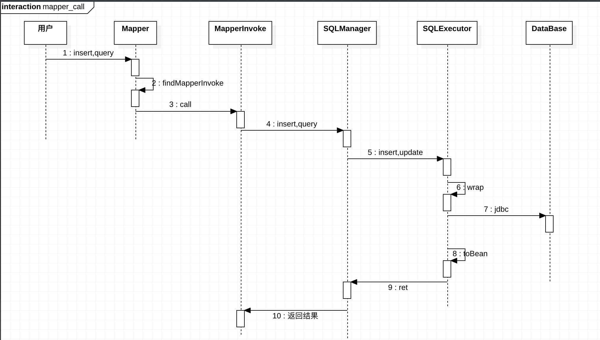
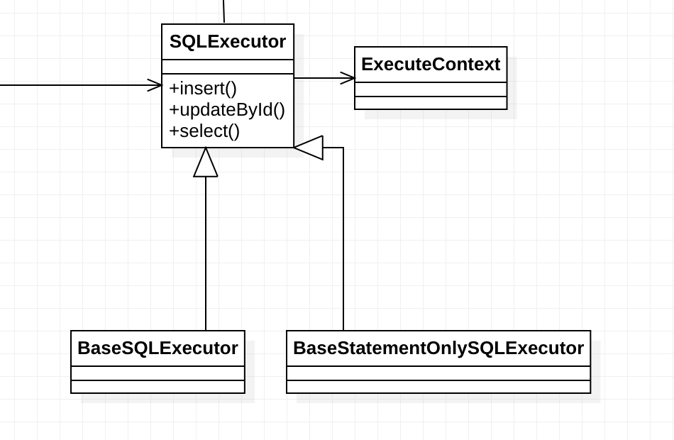

[TOC]


# BeetlSQL，DAO平台设计指南

BeetlSQL设计为一个Dao平台，可以在其搭建SQL和NOSQL 访问工具，如果遵循BeetlSQL的API和机制，其DAO会简单易用，功能强大，并解决现有Dao工具中跨数据库，维护重构难，开发效率低的问题

## 自定义Mapper


使用或者定制BeetlSQL，可以从Mapper开始，BeetlSQL提供了BaseMapper接口，作为推荐的使用BeetlSQL首选方式

```java
public interface UserMapper extends BaseMapper<User>{
  
}
```

这里，我们假定一个User对象，我们希望对其增删改查，对应数据库user表。

> 如果你还不熟悉BeetSQL用法，阅读《BeetlSQL使用指南》


BaseMapper提供了内置的CRUD等若干方法，满足50%的常用DAO操作,选取如下4个方法

```java

public interface BaseMapper<T> {
  
  @AutoMapper(InsertAmi.class)
  void insert(T entity);
  
  @AutoMapper(UpdateByIdAmi.class)
  int updateById(T entity);
  
  @AutoMapper(UniqueAmi.class)
  T unique(Object autoKey);
  
  @AutoMapper(SingleAmi.class)
  T single(Object autoKey);
  
}

```

* insert 插入User到相应的表里
* updateById，更新User，按照主键id作为条件更新
* unique，按照主键查找User，如果未找到，抛出异常
* single，同unique，如果未找到，返回null


这四个内置方法，都使用了注解@AutoMapper，定义如下

```java
@Target({java.lang.annotation.ElementType.METHOD})
@Retention(RetentionPolicy.RUNTIME)
public @interface AutoMapper {
	Class<? extends MapperInvoke> value() ;
}
```


AutoMapper需要提供一个类，必须是`MapperInvoke`的子类，此子类真正负责执行Dao操作。我们以InsertAmi为例子，代码如下

```java
public class InsertAmi implements MapperInvoke {
    @Override
    public Object call(SQLManager sm, Class entityClass, Method m, Object[] args) {
        int ret = sm.insert(args[0]);
        return ret;
    }
}
```


可以看到InsertAmi非常简单，仅仅调用SQLManager的insert方法，SQLManager是BeetlSQL提供的核心类.流程如下



如果你想定义自己的通用Mapper，可以定义任意一个接口，或者继承已经做好的BaseMapper，使用@AutoMapper标明其实现类即可。


除了AutoMapper注解，BeetlSQL也提供了其他注解，甚至是可以自定义注解，解释如下

BeetlSQL提供了@Sql注解，允许同时提供sql语句

```java

@Sql("select * from beetlSQLSysUser where id= ?)
public User queryById(Integer id);
```

解释@Sql注解的也是一个MapperInvoke子类，位于org.beetl.sql.mapper.ready包下，

```java
public class SelectSQLReadyMI extends BaseSQLReadyMI {
    boolean isSingle = false;
    public SelectSQLReadyMI(String sql,Class targetType,boolean isSingle){
        this.sql = sql;
        this.targetType = targetType;
        this.isSingle = isSingle;
    }

    @Override
    public Object call(SQLManager sm, Class entityClass, Method m, Object[] args) {
        SQLReady sqlReady = new SQLReady(this.getSql(),args);
        List list =  sm.execute(sqlReady,this.getTargetType());
        if(isSingle){
            return list.isEmpty()?null:list.get(0);
        }else{
            return list;
        }
    }
}
```


可以看到，SelectSQLReadyMI的call方法仍然非常简单，调用SQLManager的jdbc查询方法。SelectSQLReadyMI的构造是通过MapperMethodParser.parse方法，稍后会介绍这个类

如果你想利用BeetlSQL实现自定义注解，比如你觉得提供sql语句繁琐，你更喜欢SpringData那种根据方法名来推测sql语句，类似如下

```java
@SpringData
public User queryByNameAndAge(String name,Integer a);
```

> Spring Data 是一个Spring封装的DAO框架，它会根据dao的方法命名来判断,如上方法，表示查询用户(query)，条件是通过name属性，因此sql是 select * from beetlSQLSysUser where name=?  and age=?


为了使BeetlSQL能识别SpringData注解，且能使用MapperInvoke执行，你可以定义SpringData注解，如下

```java
@Target({java.lang.annotation.ElementType.METHOD})
@Retention(RetentionPolicy.RUNTIME)
@Builder(SpringDataBuilder.class)
public @interface SpringData {

}
```


这里，@SpringData注解又使用了BeetlSQL的@Builder注解，这表明@SpringData注解的解释是通过此类来定义的，BeetlSQL期望SpringDataBuilder实现MapperExtBuilder接口,能解析当前方法，返回一个MapperInvoke接口，类似如下

```java
public class SpringDataBuilder  implements MapperExtBuilder {
    @Override
    public MapperInvoke parse(Class entity, Method m) {
        ......
    }
}

```

MapperExtBuilder 用于解析Mapper定义的方法，转化为对应的sql查询（通常是调用SQLMananager API），系统已经提供了SpringDataBuilder和ProviderMapperExtBuilder .

@Builder注解是BeetlSQL一个很强大的注解，它是注解的注解，表明了注解的含义，我们在后面还能看到很多注解都采用了@Builder这个方法，比如Mapper中的SqlProvider, Bean的注解扩展@UpdateTime,以及关联查询的@FetchOne，@FetchMany


## DBStyle

DBStyle接口定义了SQL数据库或者兼容JDBC的大数据的方言，用户根据自己的SQL或者NOSQL，可以使用BeetlSQL自带的，也可以做扩展。DBStyle定义如下

```java
/**
 * 用来描述数据库差异，主键生成，sql语句，翻页等
 *
 * @author xiandafu
 */
public interface DBStyle extends DBAutoGeneratedSql {


    /**
     * 返回DBStyle名称
     * @return
     */
    String getName();

    /**
     * 返回一个DBStyle代码
     * @return
     */
    int getDBType();

  
     /**
     * 翻页语句实现
     * @return
     */
    RangeSql getRangeSql();;

    int getIdType(Class c,String idProperty);

  	/**
     * sql中的关键字处理
     * @param keyWordHandler
     */
    KeyWordHandler getKeyWordHandler();
    
    /**
     * 通过序列名字返回获取序列值的sql片段
     * @param seqName
     * @return
     */
    public String getSeqValue(String seqName);


    /**
     * jdbc 的batch 个数在数据库收到限制，beetlsql会把批处理数据分批处理
     * 这里配置了一个数据库允许的最大批处理个数，默认1000个
     * @return
     */
    default int getMaxBatchCount(){
        return 1000;
    }

    /**
     * 是否是NOSql
     * @return
     */
    default boolean  isNoSql(){
        return false;
    }

    /**
     * 对应的数据库是否支持jdbc metadata
     * @return
     */
    default boolean metadataSupport(){
        return true ;
    }

    /**
     * 是否支持PreparedStatement，对于数据库来说，几乎都支持，对于Nosql，则不一定支持
     * @return
     */
    default boolean preparedStatementSupport(){
        return true;
    }

    /**
     * 如果不支持preparedStatement，在直接使用Statement的时候，返回输出变量到sql语句里，例如，当变量是字符串a"bc
     * 应该输出{@code "a\"bc"}
     * @param value
     * @return
     */
    public String wrapStatementValue(Object value);

    /**
     * 得到一个SQL执行类
     * @param executeContext
     * @return
     */
    SQLExecutor buildExecutor(ExecuteContext executeContext);

    MetadataManager initMetadataManager(ConnectionSource cs);

    MetadataManager initMetadataManager(ConnectionSource cs,String defaultSchema,String defalutCatalog);
  
    void init(SQLTemplateEngine sqlTemplateEngine);

}

```

对于不同数据库，有一些需要重点关注的方法

## RangeSql

`RangeSql` ，表示翻页辅助工具，RangeSql类能接受一个普通jdbc sql或者模板sql，输出一个翻页语句，比如Mysql,H2，SQLLite，达梦共同使用了OffsetLimitRange，定义如下

```java
public class OffsetLimitRange implements RangeSql {
    AbstractDBStyle sqlStyle = null;
    public OffsetLimitRange(AbstractDBStyle style){
        this.sqlStyle = style;
    }

    @Override
    public String toRange(String jdbcSql, Object objOffset , Long limit) {
        Long offset = (Long)objOffset;
        offset = PageParamKit.mysqlOffset(sqlStyle.offsetStartZero, offset);
        StringBuilder builder = new StringBuilder(jdbcSql);
        builder.append(" limit ").append(offset).append(" , ").append(limit);
        return builder.toString();
    }

    @Override
    public String toTemplateRange(Class mapping,String template) {
        return template + sqlStyle.getOrderBy() +
                " \nlimit " + sqlStyle.HOLDER_START + DBAutoGeneratedSql.OFFSET + sqlStyle.HOLDER_END
                + " , " + sqlStyle.HOLDER_START + DBAutoGeneratedSql.PAGE_SIZE + sqlStyle.HOLDER_END;
    }

    @Override
    public void addTemplateRangeParas(Map<String, Object> paras, Object objOffset, long size) {
        Long offset = (Long)objOffset;
        paras.put(DBAutoGeneratedSql.OFFSET, offset - (sqlStyle.offsetStartZero ? 0 : 1));
        paras.put(DBAutoGeneratedSql.PAGE_SIZE, size);
    }
}
```

如果不同的数据库，或者NOSQL，或者查询引擎，需要实现RangeSql，


`preparedStatementSupport` 表示数据库是否支持JDBC PreparedStatement，大部分数据库都支持，如果有不支持情况，需要返回false，这样，BeetlSQL使用JDBC的时候，将使用Statement而不是PreparedStatement。同时，还需要覆盖`wrapStatementValue`方法，BeetlSQL在拼接sql语句的时候，将调用这个方法，把输出结果直接拼接到sql里

## BaseSQLExecutor



`buildExecutor` 返回BeetlSQL的核心类Executor，其子类有BaseSQLExecutor，用于普通jdbc 的执行，以及BaseStatementOnlySQLExecutor，用于当数据库不支持PreparedStatement的时候(比如presto db)，用户也可以返回自定义,通过` dbStyle. buildExecutor(ExecuteContext executeContext);`

Executor来从核心层面定制BeetlSQL，Executor接口定义如下

```java
 /**
     * 插入一条记录到clazz指定的表，参数是paras，clazz如果申明了自增，序列，或者其他数据库返回值，
     * 插入后，会取出这些值赋值到paras对象里
     * @param clazz
     * @param paras
     * @return
     */
    int insert(Class clazz, Object paras);


    /**
     * 插入一条记录，参数是paras，sql语句通过
      * @param paras
     * @return
     */
    int insert(Object paras);

    /**
     * 插入数据，cols表明需要获取的返回数据，比如自增id，或者其他数据库自动生成数据
     *
     * @param paras
     * @param cols
     * @return
     */
    Object[] insert(Object paras, String[] cols);

    /**
     * 获得一条记录，如果有多条，取第一条，如果没有，则返回null
     * @param paras
     * @param target
     * @param <T>
     * @return
     */
    <T> T singleSelect(Object paras, Class<T> target);

    /**
     * 获取一条记录，如果有多条或者没有，抛异常
     * @param paras
     * @param target
     * @param <T>
     * @return
     */
    <T> T selectUnique(Object paras, Class<T> target);

    /**
     * 查询，映射结果到clazz里
     * @param clazz
     * @param paras
     * @param <T>
     * @return
     */
    <T> List<T> select(Class<T> clazz, Object paras);


    /**
     * 将JDBC结果集映射到clazz，所有查询api都调用此接口做映射
     * @param rs
     * @param clazz
     * @param <T>
     * @return
     * @throws SQLException
     */
    <T> List<T> mappingSelect(ResultSet rs, Class<T> clazz) throws SQLException;

    /**
     * 范围查找
     * @param paras
     * @param clazz
     * @param start
     * @param size
     * @param <T>
     * @return
     */
    <T> List<T> select(Object paras, Class<T> clazz, long start, long size);

    /**
     *
     * @param paras
     * @return
     */
    long selectCount(Object paras);


    /**
     * 更新对象
     * @param obj
     * @return
     */
    int update(Object obj);

    int[] updateBatch(Object[] batchObjects);

    int[] updateBatch(List<?> list);

    int[] insertBatch(List<?> list);


    <T> T unique(Class<T> clazz, Object objId);

    <T> T single(Class<T> clazz, Object objId);

    boolean existById(Class clazz, Object objId);


    int deleteById(Class<?> clazz, Object objId);

    <T> List<T> sqlReadySelect(Class<T> clazz, SQLReady p);

    int sqlReadyExecuteUpdate(SQLReady p);

    int[] sqlReadyBatchExecuteUpdate(SQLBatchReady batch);

    /**
     * 执行sql模板，得到sql语句和参数
     * @param paras
     * @return
     */
    SQLResult run(Object  paras);

    SQLResult run(Object paras, TemplateContext ctx);


    Map wrap(Class target,Object paras);
    Map wrap(Object paras);

    ExecuteContext getExecuteContext();
```


由于大多数方法都是通过执行模板引擎获得目标sql，因此需要把参数值封装成Map，这是调用wrap方法来实现的，如果参数已经是Map，则不需要处理，如果参数是一个普通对象，则做如下封装

```java
@Override
public Map wrap(Class clazz, Object paras) {
executeContext.target = clazz;
if (paras instanceof  Map) {
return (Map) paras;
}
Map map = executeContext.wrap(this.executeContext, paras);
return map;
}
```

封装对象成map，主要的是设置一个key为_root的的对象，Beetl模板引擎在寻找变量的时候，root变量是个特殊性的变量，比如User对象作为root变量，则下的所有属性都可以直接引用，下面俩行代码是同样的

```java
print(_root.name);
print(name);
```

除了封装成_root，还会变量是否有特殊注解需要处理，比如那些实现AttributeConvert的注解，会调用此类得到一个新的值，放到map里，如下对象属性有一个Json注解，使用了AttributeConvert

```java
@Json
private JsonNode info;
```

那么，在调用wrap后，map应该是如下结构

```java
{"_root":beetlSQLSysUser,"info":"{xxxxxx}"}
```

Beetl在变量表里，优先直接使用info属性，而不是_root.info,这种机制非常灵活，既不会改变原有对象，又能实现数据库操作之前转化


## MetadataManager

`initMetadataManager`方法是SQLManager初始化的时候调用，返回MetaManager类，用于管理数据库的metadata信息，定义如下

```java
public interface MetadataManager {
     boolean existTable(String tableName);
     TableDesc getTable(String name);
     Set<String> allTable();
     void addTableVirtuals(String realTable,String virtual);

}
```

通常,可以根据JDBC规范直接调用DatabaseMetaData获取数据库表信息，参考代码`SchemaMetadataManager`，如果有些库不支持metadata，譬如drill，查询文件，不提供metadata，你需要使用其`NoSchemaMetaDataManager`，此类能接受多个POJO类，根据POJO的定义，解析成MetaData信息，有点类似Hibenrate那样根据POJO类生成数据库

```java
 public NoSchemaMetaDataManager(List<Class> beans){
        beans.forEach(bean->parseBean(bean));
    }

    public void addBean(Class bean){
        parseBean(bean);
    }

    protected void parseBean(Class bean){
    }
}
```

parseBean会解析bean，得出目标数据库表的信息

## ExecuteContext

`ExecuteContext`代表了BeetlSQL的执行上下文信息，SQLExecutor.getExecuteContext 返回一个实现。通常这个类不需要扩展

```java
public class ExecuteContext {

    /**
     * sqlId
     */
    public SqlId sqlId ;
    /**
     * select 语句需要映射的对象，有可能没有，比如update语句
     */
    public Class target;

    /**
     * 原始参数
     */
    public Object inputParas;

    /**
     * sql模板
     */
    public SQLSource sqlSource;


    /**
     * ViewType类型，如果viewType不为null
     */
    public Class viewClass = null;
    /**
     * 行映射类，与resultMapper只能二选一存在
     */
    public RowMapper rowMapper = null;
    /**
     * Bean映射类
     */
    public ResultSetMapper resultMapper = null;

    /**
     * 用来负责将ResultSet映射到对象上，如果此不为null，则使用此类负责迎合，
     * 否则，参考RowMapper或者ResultSetMapper，如果也为null，则使用SQLManager的默认的BeanProcessor
     */
    public BeanProcessor beanProcessor = null;


    //TODO,改成get方法，方便扩展
    public SQLManager sqlManager;

    /**
     * sql模板渲染后的sql语句和参数
     */
    public SQLResult sqlResult = new SQLResult();

    /**
     * Executor执行结果,非convert，fetch扩展操作结果
     */
    public Object executeResult;

    /**
     * 在执行过程中的产生控制
     */
    public Map<String,Object> contextParas;
```


在BeetlSQL执行过程中，BeetlSQL依据context里提供的信息可以进一步扩展，比如根据rowmapper或者resultMapper进行映射，这俩个类可以在执行过程中改变，比如在sql模板语句中修改rowMapper实现类，以实现个性化映射。默认情况下，这俩个类为空，关于映射，参考下一章个性化映射


## 数据库表到Java对象

BeetlSQL提供多种方式实现数据库映射，包括

* 约定习俗，指定NameConversion
* 通过@Table和@Column注解
* 通过ViewType 只映射一部分结果集
* 通过RowMapper自定义行映射，想在如上映射结果基础上，在定制映射结果
* 通过ResultSetMapper 自定义结果集映射，这有包含了@JsonMapper 的实现JsonConfigMapper和AutoJsonMapper俩种复杂结果集映射，类似MyBatis通过XML配置映射

映射完毕后，可以通过AttributeConvert或者BeanConvert再次对映射结果处理。比如加密字段的解密，或者字符串变成json操作

在返回结果集前，BeetlSQL还会查看是否有@Fetch标签，进行额外数据的抓取

### NameConversion 

NameConversion 定义了如何把Java名字转化为数据库名字，或者相反

```java
public abstract String getTableName(Class<?> c);
public abstract String getColName(Class<?> c,String attrName);
public abstract String getPropertyName(Class<?> c,String colName);

```

NameConversion 的子类内置了DefaultNameConversion，即不做任何改变。UnderlinedNameConversion，把下划线去掉，其后字母大写。最为常用，也符合数据库设计规范，使用UnderlinedNameConversion

重写NameConversion需要考虑读取@Table和@Cloumn注解，可以复用NameConversion.getAnnotationColName,getAnnotationAttrName和getAnnotationTableName,如下是UnderlinedNameConversion的实现


```java
@Override
public String getTableName(Class<?> c) {
  String name = getAnnotationTableName(c);
  if(name!=null){
    return name;
  }
  return StringKit.enCodeUnderlined(c.getSimpleName());
}

@Override
public String getColName(Class<?> c,String attrName) {
  String col = super.getAnnotationColName(c,attrName);
  if(col!=null){
    return col;
  }
  return StringKit.enCodeUnderlined(attrName);
}

@Override
public String getPropertyName(Class<?> c,String colName) {
  String attrName = super.getAnnotationAttrName(c,colName);
  if(attrName!=null){
    return attrName;
  }
  return StringKit.deCodeUnderlined(colName.toLowerCase());
}
```


### ViewType

ViewType 类似Jackson的@View注解，在BeetlSQL查询过程中，查询被VIewType申明的字段,如下TestUser，属性myId和myName被@View注解标注，因此sqlManager指定viewType为KeyInfo.class的时候，仅仅查询此俩列

```java
 TestUser keyInfo = sqlManager.viewType(TestUser.KeyInfo.class).unique(TestUser.class, 1);

@Data
public static class TestUser {
  public static interface KeyInfo {
  }

  @Column("id")
  @AutoID
  @View(KeyInfo.class)
  Integer myId;

  @Column("name")
  @View(KeyInfo.class)
  String myName;

  Integer departmentId;
}

```


VIewType会影响代码生成，因此对于TestUser对象来说，根据主键查询会有俩条内置sql语句生成，参考代码AbstractDBStyle

```java
public SQLSource genSelectByIds(Class<?> cls,Class viewType) {
  ConcatContext concatContext = this.createConcatContext();
  Select select = concatContext.select();
  appendIdsCondition(cls,select);
  select.from(cls);
  if(viewType!=null){
    select.all(cls,viewType);
  }else{
    select.all();
  }
  return new SQLTableSource(select.toSql());
}
```


对于普通的sql'语句，也可以只映射部分查询结果，而不需要映射所有结果集，比如某些大字段（TODO，未完成)

### RowMapper

RowMapper 可以在BeetlSQL默认的映射规则基础上，添加用户自定义映射，RowMapper可以通过SQLManager传入，或者通过POJO上的注解来申明，比如

```java
@RowProvider(MyRowMapper.class)
public static class TestUser2 extends TestUser {

}
```

所有查询结果映射到TestUser2后，还需要执行MyRowMapper接口

@RowProvider注解定义如下

```java
@Retention(RetentionPolicy.RUNTIME)
@Target(ElementType.TYPE)
public @interface RowProvider {
	Class<? extends RowMapper>  value();
}
```


### ResultSetMapper

ResultSetMapper对象相当于告诉BeetlSQL，不需要BeetlSQL来映射，交给ResultSetMapper来实现，比如一个select join结果需要映射到复杂的对象上（比如一个用户有多个角色，属于多个组织),BeetlSQL自带了JsonConfigMapper实现，用json来申明如何映射，类似MyBatis用xml来申明如何映射

```java
String sql = "select d.id id,d.name name ,u.id u_id,u.name u_name " +
                " from department d join beetlSQLSysUser u on d.id=u.department_id  where d.id=?";
Integer deptId = 1;
SQLReady ready = new SQLReady(sql,new Object[]{deptId});
List<DepartmentInfo> list = sqlManager.execute(ready,DepartmentInfo.class);

@Data
@ResultProvider(JsonConfigMapper.class)
@JsonMapper(
  "{'id':'id','name':'name','users':{'id':'u_id','name':'u_name'}}") 
public static class DepartmentInfo {
  Integer id;
  String name;
  List<UserInfo> users;
}
```

注解ResultProvider提供了一个ResultSetMapper实现类，@JsonMapper是一个配置注解，与ResultProvider搭档，提供额外配置，JsonMapper支持配置在java代码里，或者通过文件配置

> Pojo类上所有注解都在`ClassAnnotation`类上存放，ResultProvider和JsonMapper 被缓存在ClassAnnotation类里，因为JsonMapper注解被`ProviderConfig`注解所申明，所以他俩是一对一
>
> ```
> @ProviderConfig()
> public @interface JsonMapper {
> 	String value() default "";
> 	String resource() default  "";
> }
> 
> ```
>
> ClassAnnotation 不仅仅寻找ResultProvider注解，也寻找使用了@ProviderConfig()的注解，并作为配置注解放在一起。BeetlSQL大量使用这种注解的注解，来提供扩展机制


JsonConfigMapper定义如下

```java
public class JsonConfigMapper extends ConfigJoinMapper {
   protected AttrNode parse(ExecuteContext ctx, Class target, ResultSetMetaData rsmd, Annotation config){
     
   }
}
```

ConfigJoinMapper 是基类，他会根据AttrNode描述来做映射，因此JsonConfigMapper只需要读取config注解申明的配置，然后转化成AttrNode即可，如果你想让配置是yml或者xml，可以实现parse方法即可


### AttributeConvert

AttributeConvert用于属性转化，定义如下

```java
public default Object toAttr(ExecuteContext ctx, Class cls,String name, ResultSet rs, int index) throws SQLException {
  return rs.getObject(index);
}
public default Object toDb(ExecuteContext ctx,  Class cls,String name, Object dbValue) {
  return dbValue;
}

```

toAttr用于把数据库转化成属性值，比如数据库字符串转成Java的json对象，toDb则是把属性值在存入数据库之前转成合适的值，比如json对象转成字符串

在定义了AttributeConvert类后，需要在定义一个注解，这样，beetlsql遇到此注解，将按照上述机制执行,注解的注解仍然使用`@Builder` 来完成，Builder接受一个AttributeConvert子类

```java
@Retention(RetentionPolicy.RUNTIME)
@Target(value = {ElementType.METHOD, ElementType.FIELD})
@Builder(Base64Convert.class)
public static @interface Base64 {

}

```

因此，可以自pojo上使用此注解

```java
@Table(name="beetlSQLSysUser")
@Data
public static class UserData{
  @AutoID
  Integer id;
  @Base64
  String name;
}
```

> 所有关于pojo的注解都在`ClassAnnotation`里维护

一个简单的实现Base64注解实现如下，这样保证name字段存入数据库是经过base64加密，取出是base64解密

```java
public static class Base64Convert  implements AttributeConvert {
  Charset utf8  = Charset.forName("UTF-8");

  public  Object toDb(ExecuteContext ctx, Class cls, String name, Object dbValue) {

    String value= (String) BeanKit.getBeanProperty(dbValue,name);
    byte[] bs = java.util.Base64.getEncoder().encode(value.getBytes(utf8));
    return new String(bs,utf8);

  }
  public  Object toAttr(ExecuteContext ctx, Class cls, String name, ResultSet rs, int index) throws SQLException {
    String value  = rs.getString(index);
    return new String(java.util.Base64.getDecoder().decode(value),utf8);
  }
}
```


### BeanConvert

BeanConvert同AttributeConvert类似，但用于整个Bean，BeanConvert定义如下

```java
public interface BeanConvert {
    public default Object before(ExecuteContext ctx, Object obj, Annotation an){
        return obj;
    }
    public default Object after(ExecuteContext ctx, Object obj, Annotation an){
        return obj;
    }
}

```


## Java对象到数据库表


##代码生成

BeetlSQL提供了弹性的代码生机制，可以根据数据库的定义生成java代码，文档，业务代码，BeetlSQL自身提供了一套生成模板，用户可以复用或者修改这些模板,或者提供新的模板，比如生成Controller代码

`SourceConfig`是核心类,接收参数SQLManager以及一组SourceBuilder，前者用于获取metadata，后者是具体执行生成过程

```java
public SourceConfig(SQLManager sqlManager,List<SourceBuilder> sourceBuilder) {
		this(sqlManager,false);
		this.sourceBuilder = sourceBuilder;

	}
public void gen(String tableName, BaseProject project){}
public void genAll(BaseProject project, SourceFilter sourceFilter){}
```

gen或者genAll方法用于开始执行，每个tableName都会传递给sourceBuilder集合，一次运行


SourceBuilder 需要实现如下方法，执行具体的生成动作

```java
public abstract void  generate(BaseProject project, SourceConfig config,Entity entity);
```


参数BaseProject提供了生成的基本信息，比如BaseProject的子类ConsoleOnlyProject，会提供一个基于System.out的输出流，因此生成的代码都打印在控制台，而SimpleMavenProject 则提供一个文件路径，代码会按照包名保存到相应的工程文件里

Entity 对象则是目标表或者视图的描述，包含了java属性，类型，数据库的列名，类型，备注等信息，足够生成一个java类

用户通常需要完成SourceBuilder来实现代码生成，生成到文件，控制台，还是其他地方则是通过BaseProject决定

如下是一个根据表生成数据库表的描述文档


```java
public class MDDocBuilder extends BaseTemplateSourceBuilder {
	public static  String mapperTemplate="doc.btl.md";
	public MDDocBuilder() {
		super("doc");
	}

	@Override
	public void generate(BaseProject project, SourceConfig config, Entity entity) {
		//BeetlSQl中的配置
		Beetl beetl = ((BeetlTemplateEngine)config.getSqlManager().getSqlTemplateEngine()).getBeetl();
		//模板
		Template template = groupTemplate.getTemplate(mapperTemplate);
		template.binding("tableName", entity.getTableName());
		template.binding("comment", entity.getComment());
		template.binding("colsMap", entity.getTableDesc().getColsDetail());
		template.binding("table", entity.getTableDesc());
		String mdFileName = StringKit.toLowerCaseFirstOne(entity.getName())+".doc..md";
		Writer writer = project.getWriterByName(this.name,mdFileName);
		template.renderTo(writer);

	}
```

对应的模板doc.btl.md 如下

```markdown

## ${tableName}

**说明**

   ${isEmpty(comment)?"无注释":comment}

**表信息**
<%
var ids = table.idNames;
%>
* 主键 ${ids}
* 表注释

| 名称 | 数据类型 | 长度  |  说明 |
| :--: | :--- | :------: |  :----: |
<% for(col in colsMap){ 

var name = col.key;

if(@ids.contains(name)){
    name="*"+name;
}
var detail = col.value;
var dbType =@org.beetl.sql.clazz.kit.JavaType.jdbcTypeId2Names.get(detail.sqlType);
%>
|${name} | ${dbType}| ${detail.size} |    ${detail.remark} |
<%}%>


```

