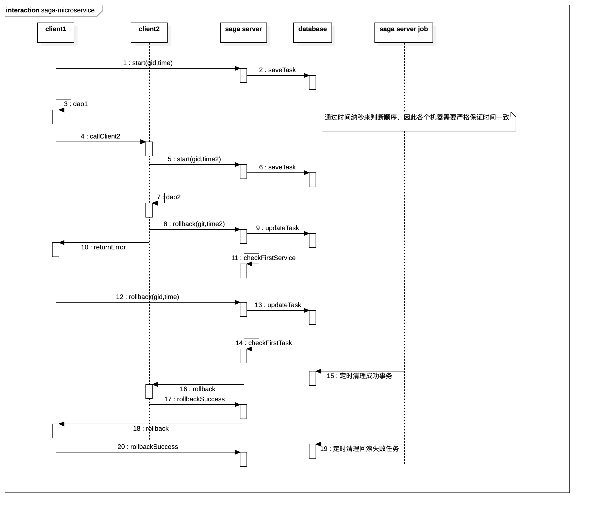

在springboot框架下，微服务解决方法

* Saga-server 负责记录回滚sql语句（以任务形式），并在需要的时候回滚。也可以定时或者UI界面触发

* database 负责保存事务数据以及回滚任务

* client，任何微服务客户端，通过kafka 发送事务数据。客户端在调用start时候，标记自己的事务，在commit或者rollback的时候发送回滚sql到saga server

* 当微服务调用链中最初的那个事务要求回滚，则表示真正需要回滚，Saga—Server会发送回滚任务到各自系，进行真正回滚

* Kafka 消息机制保证了回滚任务一定能被执行。

> 注意，采用客户端异步消息方式同saga-server 交互，问题是回滚可能带来延迟。即提示用户出错，
> 但数据当时还可能没有回滚.这依赖于Saga—Server和消息服务器的性能，本示例是秒级回滚，不影响体验
  

* start，发送全局事务gid+纳秒时间戳 到事务管理服务器，其负责检测是否有同样的事务id，如果有，则加入，如果没有，则创建

* commit，保存所有rollback语句到服务器

* rollback， 保存所有rollback语句到服务，并设置rollback标记给服务器，
服务器接收到rollback标记，标记事务失败。但并不立即回滚。直到最外层的事务rollback标记发回才开始开始回滚，取出所同一个gid的rollback语句，然后再发回到各个客户端，客户端依次执行，并反馈结果到saga-server。
服务器会判断如果所有成功执行rollback，则标记事务成功回滚 则发回失败。 服务器接收到失败后，，标记下次回滚时间。成功的则不需要标记

* 服务器提供API查询事务和其所有回滚任务，以通过界面再次执行事务回滚或者特定的任务

关键设计：
* Saga-Server通过Kafka接受回滚任务，考虑到消息机制，因此Saga—Server可以是水平扩展，保证其工作可靠性
* 服务器和客户端通过消息队列，同样的gid，将顺序发送给同样的Saga—Server，以保证顺序。这里需要保证各个客户端的时间是一致的
* 回滚任务由各个客户端生成，beetlsql的saga mapper会自动生成操作的逆向操作（不需要解析sql来生成逆向sql）

  

